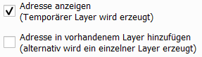

# Adresssuche

### _QGIS-Plugin zur Suche von Adressen_

Fragen, Anmerkungen, Fehlermeldungen, etc. bitte gerne per E-Mail an [thomas.knaeuper@stud.hs-bochum.de] mitteilen.

<!--  -->

## Inhalt
- [Hinweise](#hinweise)
- [Features](#features)
- [Installation](#installation)
- [Verwendung](#verwendung)
  - [Reiter Daten](#reiter-daten)
  - [Reiter Suche](#reiter-suche)
    - [zusätzliche Funktionen](#zusätzliche-funktionen)
- [Daten](#daten)

## Hinweise
Die Adresssuche ist für die Suche im Hauskoordinatenformat vorgesehen.  
Auf der Webseite der [AdV] wird dieses genauer erläutert.

## Features
- Suche von Adressen über:
    - Straße
    - Hausnummer
    - Adresszusatz
    - Postleitzahl
    - Ort

## Installation

Das Plugin ist im offiziellen [QGIS-Plugin-Repository] enthalten und kann in QGIS über *Erweiterungen -> Erweiterungen verwalten und installieren* installiert und auch bei Verfügbarkeit einer neuen Version aktualisiert werden.

## Verwendung

### Reiter Daten

Hier muss die Datengrundlage, auf der gesucht wird, hinzugefügt werden.  
Ein Testdatensatz, der AdV steht bereits in [data] zur Verfügung.  
Derzeit müssen die Daten Offline zur Verfügung stehen.

### Reiter Suche

Im Reiter "Suche" gibt es die Möglichkeit über die eingeladenen Adressdaten zu Suchen.  
Die Suche kann über die unter [Features](#features) aufgeführten Begriffe gesucht werden.  
  
Sobald mit dem Eintippen des Suchbegriffs begonnen wird, beginnt die Suche.  
In der Tabelle werden alle Suchergebnisse aufgelistet.  
Durch das Auswählen eines Vorschlags kann, entweder über den Button *Zoom zur Adresse* oder einen Doppelklick, auf den gewünschten Punkt gezoomt werden.  
Für jede Adresse wird ein Feature mit Attributen erzeugt.

#### Zusätzliche Funktionen

Vor der Suche kann die Option *über die aktuelle Ausdehnung suchen* festgelegt werden.  
Um eine effizientere Suche zu ermöglichen, wird es empfohlen diese Option bei großen Datensätzen zu verwenden.
  

Beim Zoom auf den Punkt gibt es verschiedene Optionen einen Layer zu generieren:

1. *Adresse anzeigen* ist ausgewählt, ein einzelner Layer für den gesuchten Adresspunkt wird generiert
2. *Adresse anzeigen* ist abgewählt, es wird zum Punkt gezoomt, ohne die Generierung eines Layers
3. *Adress anzeigen* und *Adresse in vorhandenem Layer hinzufügen* sind ausgewählt, gesuchte Adressen werden in einem einzigen Layer gesammelt

## Daten

Die Daten müssen als *.txt* oder *.csv* zur Verfügung stehen. Außerdem muss die Codierung *utf-8* verwendet werden.  
Weitere Information entnehmen sie bitte der Datenformatbeschreibung der [AdV].

[thomas.knaeuper@stud.hs-bochum.de]: <mailto:thomas.knaeuper@stud.hs-bochum.de?subject=Adresssuche%20Plugin>
[Adv]:<https://www.adv-online.de/AdV-Produkte/Standards-und-Produktblaetter/ZSHH/>
[QGIS-Plugin-Repository]:<https://github.com/thmskn/address_search>
[data]:<https://github.com/thmskn/address_search/tree/main/data>