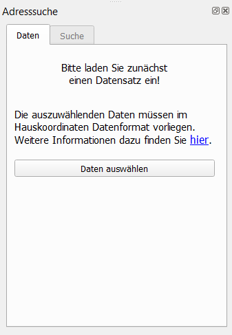
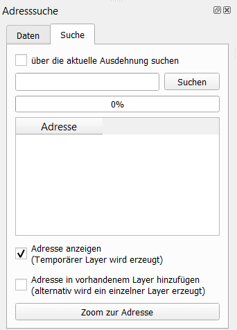
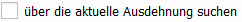

# Adresssuche

### _QGIS-Plugin zur Suche von Adressen_

Fragen, Anmerkungen, Fehlermeldungen, etc. bitte gerne per E-Mail an [thomas.knaeuper@stud.hs-bochum.de] mitteilen.

<!--  -->

## Inhalt
- [Hinweise](#hinweise)
- [Features](#features)
- [Installation](#installation)
- [Verwendung](#verwendung)
  - [Reiter Daten](#reiter-daten)
  - [Reiter Suche](#reiter-suche)

- [Daten](#daten)

## Hinweise
Die Adresssuche ist für die Suche im Hauskoordinatenformat vorgesehen.  
Auf der Webseite der [AdV] wird dieses genauer erläutert.

## Features
- Suche von Adressen über:
    - Straße
    - Hausnummer
    - Adresszusatz
    - Postleitzahl
    - Ort

## Installation

Das Plugin ist im offiziellen [QGIS-Plugin-Repository] enthalten und kann in QGIS über *Erweiterungen -> Erweiterungen verwalten und installieren* installiert und auch bei Verfügbarkeit einer neuen Version aktualisiert werden.

## Verwendung

### Reiter Daten

Hier muss die Datengrundlage, auf der gesucht werden soll, hinzugefügt werden.  
Ein Testdatensatz, der AdV steht bereits in [data] zur Verfügung.  
Derzeit müssen die Daten Offline zur Verfügung stehen.

### Reiter Suche

Im Reiter "Suche" gibt es die Möglichkeit über die eingeladenen Adressdaten zu Suchen.  
Die Suche kann über die unter [Features](#features) aufgeführten Begriffe gesucht werden.

Vor der Suche kann die Option *über die aktuelle Ausdehnung suchen* festgelegt werden.  
Um eine effizientere Suche zu ermöglichen, wird es empfohlen diese Option bei großen Datensätzen zu verwenden.

Sobald mit dem Eintippen des Suchbegriffs begonnen wird, beginnt die Suche.

Im Reiter „Flurstück suchen“ gibt es mehrere Möglichkeiten, um nach einem Flurstück zu suchen:

1. Über die Dropdown-Menüs Gemarkung, Gemarkungsschlüssel, Flurnummer und Flurstücksnummer
2. Direkte Suche über das verkürzte Kennzeichen Gemarkung-Flur-Flurstück (z.B. `3230-1-1`)
3. Über die ALKIS-ID (z.B. `DENW33AL00009NPL`)
4. Über das Flurstückskennzeichen, z.B. `05320308900675______` (20 Zeichen)

Bei Variante 1 stehen nur Elemente zur Auswahl, die auf dem WFS-Server für den jeweiligen Kastasteramtsbezirks vorhanden sind.
Variante 2, 3 und 4 ermöglichen die direkte Suche über ein Kennzeichen oder eine ALKIS-ID. Die Suche kann hier mit einem Klick auf das Lupen-Symbol oder mit der ENTER/Return-Taste ausgeführt werden. Ist _NRW_ im Reiter Einstellungen ausgewählt, wird mit einer ID NRW-weit gesucht.

Sobald ein gültiges Flurstück ausgewählt oder gesucht wurde, werden die Knöpfe freigeschaltet und das ausgewählte Flurstück im Kartenfenster angesteuert.

#### Funktionsknöpfe
| Funktionsknopf | Funktion |
|--|--|
|   | Das Globus-Symbol öffnet [TIM-online] (bei Verwendung des NRW-WFS) bzw. das [Geoportal Niederrhein] (bei Verwendung des KRZN-WFS für Kreis Viersen, Kleve, Wesel oder Stadt Krefeld) an der Position des gewählten Flurstücks. |
|   | Das iD-Symbol stellt eine Verbindung zum OpenStreetMap [iD]-Editor her. Zur Bearbeitung ist ein kostenloses  [OpenStreetMap-Benutzerkonto] erforderlich.|
|   | Das Karten-Symbol stellt eine Verbindung zu [JOSM] (Java OpenStreetMap Editor) her. Diese Funktion sollte nur genutzt werden, wenn JOSM auf dem Endgerät in einem der beiden folgenden Verzeichnisse installiert ist: `C:\Program Files (x86)\JOSM` oder `C:\Users\[Windows-User]\AppData\Local\JOSM`. Zur Bearbeitung ist ein kostenloses [OpenStreetMap-Benutzerkonto] erforderlich.|
|   | Durch einen Klick auf das Plus-Symbol kann das Polygon des Flurstücks dem Kartenbild hinzugefügt werden. |
|   |  Durch das Minus-Symbol wird das mit Klick auf das Plus-Symbol hinzugefügte Flurstück wieder entfernt. |

## Daten

Die Daten müssen als *.txt* oder *.csv* zur Verfügung stehen. Außerdem muss die Codierung *utf-8* verwendet werden.  
Weitere Information entnehmen sie bitte der Datenformatbeschreibung der [AdV].

[thomas.knaeuper@stud.hs-bochum.de]: <mailto:thomas.knaeuper@stud.hs-bochum.de?subject=Adresssuche%20Plugin>
[Adv]:<https://www.adv-online.de/AdV-Produkte/Standards-und-Produktblaetter/ZSHH/>
[QGIS-Plugin-Repository]:<https://github.com/thmskn/address_search>
[data]::<https://github.com/thmskn/address_search/tree/main/data>